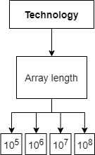

# Results of parallel quicksort test

This folder contains results of parallel quicksort test for each test case. 

Tree of test cases for each of researched technologies is shown on the picture below. 

There are 4 test cases for each technology which gives total number of tests for parallel quicksort equal to 12.

This folder has structure similar to one represented on picture. 
Each of test cases is represented by a folder with following name schema: 

`quicksort-technology-array_length`
eg. quicksort-webworkers-20000000. 

Each folder contains two csv files: 

* time results for 50 repetitions of test,
* occupancy of memory (bytes) and CPU (percent) for web browser related processes read every 1 second. 
Files related to memory and CPU have "CPU" prefix in the name of file. 

Folder called "Plots" contains graphical representations of obtained results and has following structure: 

* Boxplots - contains boxplot describing obtained data for each of variables, 
* QQPLots - contains quantile-quantile plots for determining if data comes from normal distribution, 
* Time - contains plots visualising median of tests execution time, 
* Cpu - contains plots visualising median of CPU occupancy percentage, 
* Memory - contains plots visualising Memory occupancy in time. 